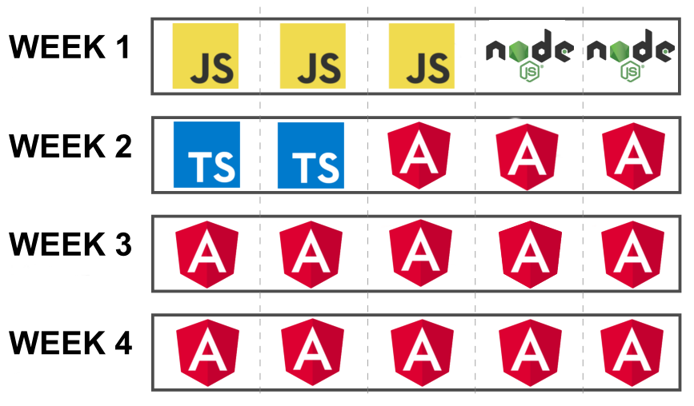

# JavaScript / Angular Bootcamp

Please, use this repository as a base for you training phase. The idea is to
fork this project so everyone use the same folder structure for the
exercises.

#### Index

1. [Objective](#objective)

2. [Who Should Attend](#who-should-attend)

3. [Duration](#duration)

4. [Technical Assistance](#technical-assistance)

5. [Performance Measurement](#performance-measurement)

6. [Handling advanced Developers](#handling-advanced-developers)

7. [Materials](#materials)

8. [Bootcamp Schedule](#bootcamp-schedule)

9. [General Guidelines](#general-guidelines)

10. [Learning Days](#learning-days)

  - 10.1 [Week 1: JavaScript and Node 101](#week-1-javascript-and-node-101)
  - 10.2 [Week 2: TypeScript and Angular 101](#week-2-typescript-and-angular-101)
  - 10.3 [Week 3: Angular 201](#week-3-angular-201)
  - 10.4 [Week 4: Angular 301 and stuff](#week-4-angular-301-and-stuff)

### Objective

This course teaches the basics of JavaScript development and [Single Page Applications](https://medium.com/@NeotericEU/single-page-application-vs-multiple-page-application-2591588efe58) with Angular.

→ [index](#index)

### Who Should Attend

The training will start at a low level and does not require in depth knowledge
of the platform in question. Desirable participant profile: trainees and outside
Globant candidates. A basic knowledge on OOP is desired, though.

→ [index](#index)

### Duration

Four weeks total. (20 days)

→ [index](#index)

### Technical Assistance

You can contact other Bootcamp participants or any available tutor if you need
technical assistance. Comunnications will take place over [Slack](https://slack.com/features) on our own [Bootcamp Channel]()

### Performance Measurement

1. Code review after each practice.

2. Checkpoint completion after Learning stage with your assigned tutor.

3. Final Application after Bootcamp.

→ [index](#index)

### Handling Advanced Developers

Developers that move faster than average can go ahead and complete as much
exercises as wanted.

→ [index](#index)

### Materials

1. You will need to install [Node.JS](https://nodejs.org/en/) (NVM is strongly recommended - [Unix](https://github.com/creationix/nvm#installation)/[Windows](https://github.com/coreybutler/nvm-windows))

2. The recommended IDE is [Visual Studio Code](https://code.visualstudio.com/). However, you can use any IDE of your preference.

3. Gmail Account + headset (For hangout calls)

4. Create your own [GitHub](https://github.com/) account. Follow
this [guideline](https://help.github.com/articles/set-up-git) to setup your
account. Also you can read further about Git in
[Try Git](https://try.github.io/levels/1/challenges/1) or
[Learn Git Branching](http://pcottle.github.io/learnGitBranching/)

5. Fork this repo to use as a base to host the project code.

→ [index](#index)

### Bootcamp Schedule

The boot camp is organized in the following way:

The first week is oriented to learn the basics around JavaScript and Node. This
Bootcamp assumes you already know the basics of Js syntax. If this is not your
case, it is recommended to take a look to the following topics:

- [Js Values, Types, and Operators](http://eloquentjavascript.net/01_values.html)
- [Js Program Structure](http://eloquentjavascript.net/02_program_structure.html)
- [Js Functions](http://eloquentjavascript.net/03_functions.html)
- [Js Data Structures: Objects and Arrays](http://eloquentjavascript.net/04_data.html)

Each day of the first week you will have a small exercise at the end of the day.
You must code the exercise inside the corresponding folder, example
`src/week1/day1/index.js` will contain the code for the exercise of the Day 1.

The second week introduces you to TypeScript and Angular. JavaScript is an easy typed language, that means
as a developer you have total control over the whole structure of the code. Sometimes that's
an advantage, but as the app grows and more people become involved things go out of hand.
That's when TypeScript comes to the rescue. At the end of this week you will have a basic Angular App running.

The third week is oriented to learn Angular at an intermediate level. Angular is one of the biggest UI frameworks
out there; there's a lot to learn. On this week's challenge you will be expected to do an application
with routing, forms, and some sweet Flexbox magic.

The last week will be focused on intermediate/advanced Angular (and not Angular exclusive) features.
You will learn about Cross-Compiled apps, Hybrid Apps, and Progressive Web Apps. At the end of the week the challenge
awaiting for you is making last week's app more scallable, you will add lazy loaded modules with routing and you will
upgrade the security with some route guards.

### General Guidelines

1. [Team play](http://www.dummies.com/how-to/content/ten-qualities-of-an-effective-team-player.html) is encouraged but the work will be evaluated per person.

2. The instructions will be vague as they generally are in real life projects.
You must look for support and guidance from your PM, teammates and tutors.

3. All code and documentation must be in English.

4. Js Code must adhere to this [Coding Style Guide](https://github.com/airbnb/javascript).

5. Ts and Angular Code must adhere to this [Coding Style Guide](https://angular.io/guide/styleguide).

→ [index](#index)

### Learning Days ###

Each day you will grab the fundamentals of the key building blocks for usual
Js/Ts/Angular applications.

On each learning day you will have to:

1. **Read:**
We will provide you with documentation related with current sprint content so
you can have a background reference, guide and examples to complete the
following practice.

2. **Practice:**
You will implement the previously gathered knowledge in simple coding activities.

3. **Commit:**
You will commit all your code on a daily basis, when you finish your practice. This will not apply for code of Week 4.

# Introduction

  - This repository contains inside the `src` directory the project structure for all exercises/challenges that you will
  need to do.

  - All `.js` code can be opened directly on the browser. For Ts and Angular code you will need to run a Liteserver with
  the Angular CLI. Just running `npm run serve` will be enough 

  - Once the server is running, all the modifications you make will be automagically synced and the app will reload.

  - [Basic GIT concepts](https://git-scm.com/book/en/v2/Git-Basics-Getting-a-Git-Repository)

→ [index](#index)

# Week 1: JavaScript and Node 101

## Day 1: The Secret Life of Objects

Js is often called an Object oriented language, but actually that isn't 100% true. In Js
we have what's called `Prototipal Inheritance`.
In this lesson you will learn all about the Prototype, Inheritance, Getters, Setters, Constructors and Polymorfism.

### Reading:

- [Objects](http://eloquentjavascript.net/06_object.html)

### Exercise:

Look into [`src/week1/day1/index.html`](src/week1/day1/index.html) in there there's an `Animal` class with a talk method. Follow the instructions.

### ~~Not So~~ Optional Reading
Since ES6 went out we do have a _Class like_ sintax, **HOWEVER** that's [Syntactic Sugar](https://en.wikipedia.org/wiki/Syntactic_sugar).
We still have that ~~hideous~~ beautiful `Prototype` under the hood, so don't get confused.

- [ES6 Class Sintax](https://developer.mozilla.org/en-US/docs/Web/JavaScript/Reference/Classes)

## Day 2: Going Regular with RegEx (Also, learn how to hunt those bugs)
One of the most ~~hated~~ used features on any kind of language are Regular Expressions, aka RegEx. Those are **REALLY** powerfull strings (they are more like a really special kind of strings) that allow you to capture any pattern you want on any kind of string. You can make sure all emails accounts end up with `@something.com` or all the names are at most 4 characters long... you get the idea.

Also, you will be learning error handling and some of the finest debugging techniques out there. Or, as I like to call them, **_learn how to properly use the browser console_**.

Read up and catch 'em all

### Reading:
- [Regular Expressions](http://eloquentjavascript.net/09_regexp.html)
- [Errors and debugging](http://eloquentjavascript.net/08_error.html)

### Exercise:
Look into [`src/week1/day2`](src/week1/day2) in there there're some `index` files, poke around and follow the instructions.

## Day 3: The browser, where the _magic_ happens

So, you have a text file called _whatever.js_, you have ~200 lines in there (or you should, codebases of ~ 1k lines are made by horrible people). You add it to an `index.html` file, double click that file, a browser opens and

The code comes to life. All works fine (at least if you coded right :unamused:) it's

No, no it's not. It's the browser's engine. Js runs inside a browser on a [VM](https://en.wikipedia.org/wiki/JavaScript_engine), that VM could be
[V8](https://developers.google.com/v8/) (Chrome), [SpiderMonkey](https://developer.mozilla.org/en-US/docs/Mozilla/Projects/SpiderMonkey) (Firefox), [Chakra](https://github.com/Microsoft/ChakraCore) (Edge) or [Nitro](https://developer.apple.com/documentation/javascriptcore) (Safari)

For day 3 you will learn about the Browser, the Document Object Model (basically the whole thing you are seeing on the browser's window) and DOM Events.

### Reading:

- [The Browser](http://eloquentjavascript.net/12_browser.html)
- [DOM](http://eloquentjavascript.net/13_dom.html)
- [Events](http://eloquentjavascript.net/14_event.html)

If you used jQuery, this is the time you realize that it's not so magic, it's Js, and you can do all the things jQuery does with vanilla Js. And in a few weeks you'll be refusing to use jQuery again :stuck_out_tongue_closed_eyes:

### ~~Not So~~ Optional Reading
The browser and the server (the little computer thingy that lives on the cloud and has all your files) communicates via `HTTP`. That's a protocol, something like a standarized way to send messages. You can read more about it here:

- [HTTP](http://eloquentjavascript.net/17_http.html)

Users communicate with the application via `forms`, those are fill up sections which where designed on a time before Js where all interactions with the server where made while navigating to a new page. That kind of interaction is **SO** web 1.0 but, we still use `forms`.

- [Forms](http://eloquentjavascript.net/18_forms.html)

### Exercise:
Look into [`src/week1/day3`](src/week1/day3) in there there're some `index` files, poke around and follow the instructions.

## Day 4 and 5: require('Node.js')
So, at this point you pretty much are up to speed with Js. But Js does not only run on a
browser. **YES** you read me right, you can make a `server`, a `robot`, a `game`, you
can eve run it on an _Arduino_. The sky's the limit.

How is that even possible you ask? Well, Js' community was aways **HUGE**, so it was more than expected that a person asked `Why not?`
That's how [`Node`](https://nodejs.org/en/) was born.

Node.js is a Js runtime that runs outside the browser on a V8 VM, there's a Node fork for almost everything.

So, first, to understand how node works, you need to learn one last thing about Js, `Modules`

- [Modules](http://eloquentjavascript.net/10_modules.html)

Then you can go on with this
- [Node](http://eloquentjavascript.net/20_node.html)
- [What is npm?](https://docs.npmjs.com/getting-started/what-is-npm)
- [Installing npm packages locally](https://docs.npmjs.com/getting-started/installing-npm-packages-locally)
- [Using a `package.json`](https://docs.npmjs.com/getting-started/using-a-package.json)
- [Updating local packages](https://docs.npmjs.com/getting-started/updating-local-packages)
- [Uninstalling local packages](https://docs.npmjs.com/getting-started/uninstalling-local-packages)
- [Installing npm packages globally](https://docs.npmjs.com/getting-started/installing-npm-packages-globally)
- [Updating global packages](https://docs.npmjs.com/getting-started/updating-global-packages)
- [Uninstalling global packages](https://docs.npmjs.com/getting-started/uninstalling-global-packages)
- [Semantic versioning and npm](https://docs.npmjs.com/getting-started/semantic-versioning)
- [How npm works?](https://docs.npmjs.com/how-npm-works/npm3)

### Exercise:

**Notes:**

→ [index](#index)

# Week 2: TypeScript and Angular 101

### Reading:

## Day 6:

### Exercise:

## Day 7: Unit Testing

### Reading:

### Exercise:

**Notes:**

## Day 8, 9 and 10: 

### Reading:

### Exercise:

→ [index](#index)

# Week 3: Angular 201

### Reading:

### Exercise:

→ [index](#index)

# Week 4: Angular 301 and stuff

### Reading:

### Exercise:

**Some advices**

## Important: