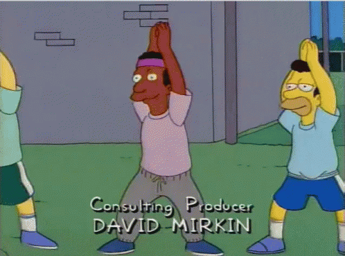
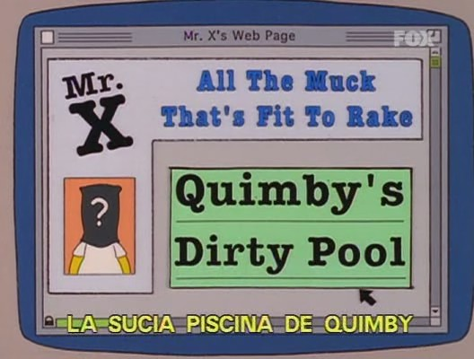
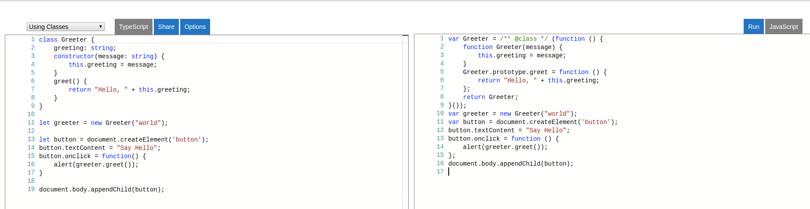
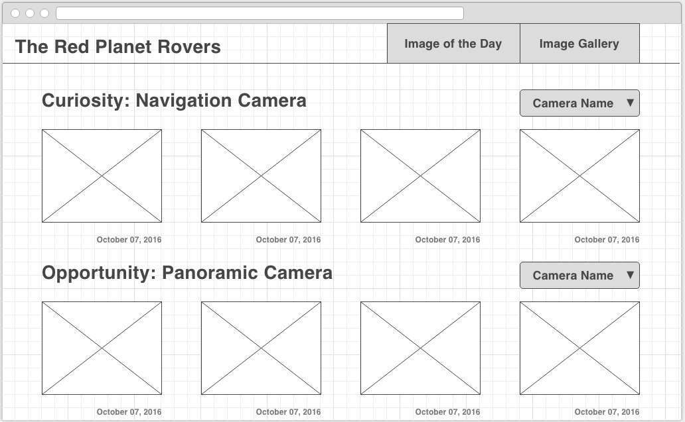
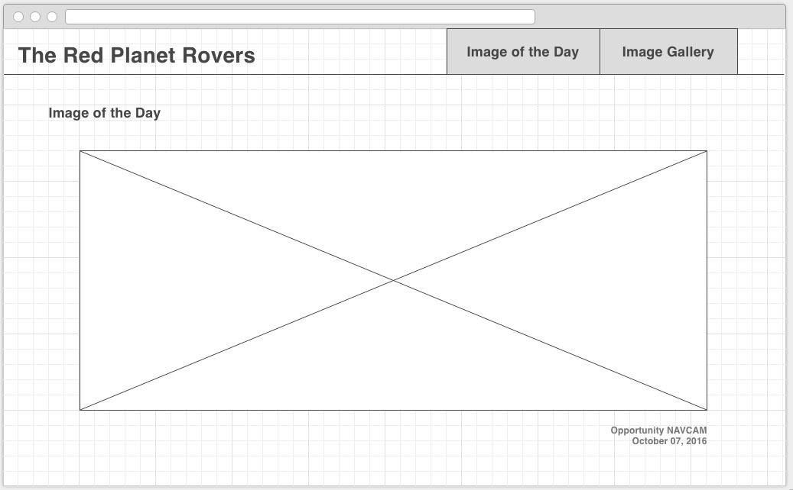
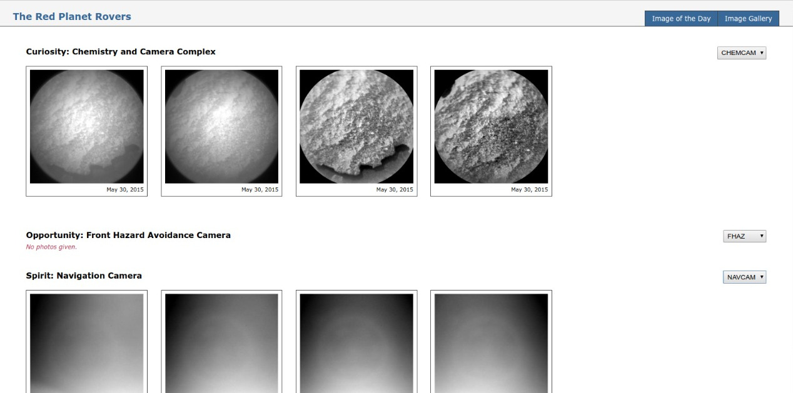
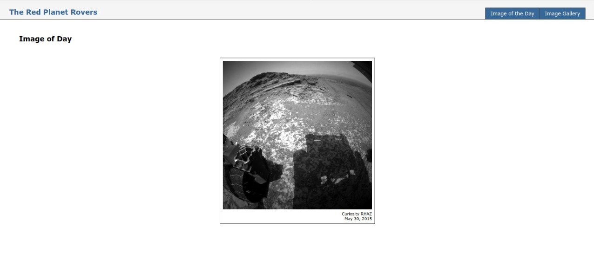
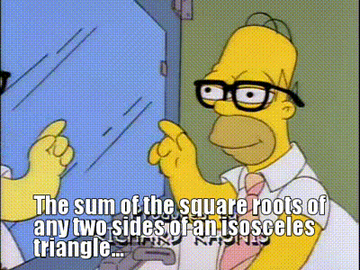

# UI Bootcamps
## HTML - CSS - JavaScript _(Angular oriented :wink:)_


## __IMPORTANT DISCLAIMER__
This is not your typical _crash course_, this is a **Bootcamp**.

What does that mean?

- _You will give your best_

- _We will give our best_

- _We will all have a good time_


But most important, there will be **A LOT** of humor, because a happy developer _(student, pupil, padawan, you get the point...)_ is a great and hard working developer.


_That said..._


## Welcome to the bootcamp, learning time has begun



Please, use this repository as a base for all your work. The idea is to
fork this project so everyone uses the same folder structure for the
exercises.

#### Index

1. [Objective](#objective)

2. [Who Should Attend](#who-should-attend)

3. [Duration](#duration)

4. [Technical Assistance](#technical-assistance)

5. [Performance Measurement](#performance-measurement)

6. [Handling advanced Developers](#handling-advanced-developers)

7. [Materials](#materials)

8. [Bootcamp Schedule](#bootcamp-schedule)

9. [General Guidelines](#general-guidelines)

10. [Learning Days](#learning-days)

  - 10.1 [Week 1: HTML, CSS and Javascript](#week-1-html-css-and-javascript)
  - 10.2 [Week 2: Diving into JavaScript and Node 101](#week-2-diving-into-javascript-and-node-101)
  - 10.3 [Week 3: TypeScript and Angular 101](#week-3-typescript-and-angular-101)
  - 10.4 [Week 4: Angular 201](#week-4-angular-201)


### Objective

We will teach you the basics of Web development using JavaScript and [Single Page Applications](https://medium.com/@NeotericEU/single-page-application-vs-multiple-page-application-2591588efe58) with `Angular`.

→ [index](#index)

### Who Should Attend

The materials will start at a low level and does not require in depth knowledge
of the platform in question. Desirable participant profile: trainees and outside
Globant candidates. A basic knowledge on OOP is desired, though.

→ [index](#index)

### Duration

Four weeks total. (20 days)

→ [index](#index)

### Technical Assistance

You can contact other Bootcamp participants or any available tutor if you need
technical assistance. Communications will take place over [Slack](https://slack.com/features) on our own [Bootcamp Workspace](https://globant-bootcamps2018.slack.com)

→ [index](#index)

### Performance Measurement

1. Code review after each practice.

2. Checkpoint completion after Learning stage with your assigned tutor.

3. Final Application after Bootcamp.

→ [index](#index)


### Handling Advanced Developers

Developers that move faster than average can go ahead and complete as much
exercises as wanted.

→ [index](#index)

### Materials

1. You will need to install [Node.JS](https://nodejs.org/en/) (Version 6) (NVM is strongly recommended - [Unix](https://github.com/creationix/nvm#installation)/[Windows](https://github.com/coreybutler/nvm-windows))

2. The recommended IDE is [Visual Studio Code](https://code.visualstudio.com/). However, you can use any IDE of your preference.

3. Gmail Account + headset (For hangout calls)

4. Create your own [GitHub](https://github.com/) account. Follow
this [guideline](https://help.github.com/articles/set-up-git) to setup your
account. Also you can read further about Git in
[Try Git](https://try.github.io/levels/1/challenges/1) or
[Learn Git Branching](http://pcottle.github.io/learnGitBranching/)

5. Fork this repo to use as a base to host the project code.

→ [index](#index)

### Bootcamp Schedule

The Bootcamp is organized in the following way:


The first week is oriented to learn the basics around HTML and CSS and JavaScript.
You will be doing some exercises along your reading

The second week dives deep into `JavaScript` and some `Node.js` _mumbo jumbo_.
Again, you will have homework to do for the week.

The third week introduces you to TypeScript and Angular. JavaScript is an easy typed language,
that means
as a developer you have total control over the whole structure of the code. Sometimes that's an advantage, but as the app grows and more people become involved things go out of hand.
That's when TypeScript comes to the rescue. At the end of this week you will make the famous `Tour of Heroes` app.

The last week will be focused on starting an app and learning some _shiny cool_ stuff. You need to present your work at the end of the week, _however_
you can keep working on it (more on that later).

### You will encounter some pages with extra excercises on them. You have the power to choose if you want to do them or not. Just remember, if you do, put them on the [extra folder](src/extra)

→ [index](#index)

### General Guidelines

1. [Team play](http://www.dummies.com/how-to/content/ten-qualities-of-an-effective-team-player.html) is encouraged but the work will be evaluated per person.

2. The instructions will be vague as they generally are in real life projects.
You must look for support and guidance from your PM, teammates and tutors.

3. All code and documentation must be in English.

4. `HTML` syntax must adhere to Globant's [HTML Style Guide](https://github.com/globant-ui/html-style-guide).

5. `CSS` code must adhere to Globant's [CSS Style Guide](https://github.com/globant-ui/css-style-guide)

6. `Js` code must adhere to Globant's [Js Style Guide](https://github.com/globant-ui/JavaScript-style-guide).

7. `Ts` and `Angular` code must adhere to [Angular's Style Guide](https://angular.io/guide/styleguide).

→ [index](#index)

### Learning Days ###

Each day you will grab the fundamentals of building blocks for usual
`Js/Ts/Angular` applications.

On each learning day you will have to:

1. **Read:**
We will provide you with documentation related with current sprint content so
you can have a background reference, guide and examples to complete the
following practice.

2. **Practice:**
You will implement the previously gathered knowledge in simple coding activities.

3. **Commit:**
You will commit all your code on a daily basis, when you finish your practice. This will not apply for code of Week 3 and 4.

→ [index](#index)

# Introduction

  - This repository contains inside the `src` directory the project structure for all exercises/challenges that you will
  need to do.

  - All `.js` code can be opened directly on the browser. For Ts and Angular code you will need to run a Liteserver with
  the Angular CLI. Just running `ng serve` or `npm run serve` will be enough 

  - Once the server is running, all the modifications you make will be automagically synced and the app will reload.

  - [Basic GIT concepts](http://rogerdudler.github.io/git-guide/)

  - __READ THAT__ :arrow_up: :arrow_up: :arrow_up:

  - [Extra GIT material](https://www.acamica.com/cursos/29/git)

→ [index](#index)

_Now let's get down to business_

# Week 1: HTML, CSS and JavaScript

## Day 0: _At the beginning t wast all HTML & CSS_

So, what's _day 0_?

We as developers know that every structure starts at `0` (any other dev or language that says the contrary is ___WRONG___) so this is the first thing you'll need to master before even trying to fight with the future topics.

### History time

Rumor has it that when the web was a little baby, at the early stages of `web 1.0` all was static and **SOOO** ugly.

You may have encounter one of those exquisite pages:



_YES_ pages looked like that _(and that's a pretty one)_ - all old HTML and CSS

Fortunately people noticed that we needed new tools to create more dynamic and stylish experiences. Technologies have evolved and now we can make gorgeous experiences like [this one](https://feeddart.com/). Regardless, the basics are still the same.

### Let's get on with it

`HTML` describes the content semantics and structure of a web page. It was designed as a markup language, if you know XML ~~(the ugly father)~~, you could consider HTML as a subset of XML with a predefined semantic _(and soooo much friendly)_.

On the other hand, CSS allows to define the look and feel of the content. It's used to set colors on HTML elements, customize sizes, define the layout of the document content, among others. (e.x. "The following list of elements must be shown as a menu", "The main title of the page should use this particular font", "_make things pretty_").

JavaScript is a programming language that runs in all Web Browsers. Using JavaScript we can create full-fledge web applications (_and some magic_).

### Reading:
- Some other Globbers made this ~~meme-less~~ awesome [HTML & CSS 101](https://github.com/globant-ui/css-lab).

### Exercise:
So... I'm going to be honest with you, I'm lazy ~~as any dev should~~ and I'm not going to re-invent the weel ~~work extra~~.
Your first days work is with our friends at [HTML & CSS 101](https://github.com/globant-ui/css-lab).
Just put all your work under [day0](src/week1/day0)

### ~~Not so~~ Optional Reading
- [Responsive Design](https://developers.google.com/web/fundamentals/design-and-ux/responsive/)
- [Web Components](https://www.webcomponents.org/introduction#what-are-web-components)
- [Why use Web Components](https://medium.com/@gilfink/why-im-betting-on-web-components-and-you-should-think-about-using-them-too-8629396e27a)
- This is your new best friend, [Flexbox](https://css-tricks.com/snippets/css/a-guide-to-flexbox/). The best responsive-friendly CSS model.

→ [index](#index)

## Day 3 - 5: Hello JavaScript

_Yes, I know I missed the other days, but c'mon. I'm giving you space to learn._

I'm sure you must be an HTML & CSS guru by now, right?


So, are you ready for your new challenge? `Js`

_JavaScript is an event driven programming language that runs in all Web Browsers. Using JavaScript we can create full-fledge web applications._

That's quite a definition, buy our friends at [Eloquent JavaScript](http://eloquentjavascript.net/00_intro.html#h_GlF1Kuv0JF) make an even better work.

I hope you liked that book, because it's going to stick with us for the rest of this (and next) week.

### Reading:

- [Js Values, Types, and Operators](http://eloquentjavascript.net/01_values.html)
- [Js Program Structure](http://eloquentjavascript.net/02_program_structure.html)
- [Js Functions](http://eloquentjavascript.net/03_functions.html)
- [Js Data Structures: Objects and Arrays](http://eloquentjavascript.net/04_data.html)

### Excercise:

I think you noticed by now, but there are a few exercises inside the reading material (awesome, I know). Do them, this is basic `Js` and we need you to have fun with it.

Just put all your work under [day2-5](src/week1/day2-5) once you finished the exercises on page.

→ [index](#index)

# Week 2: Diving into JavaScript and Node 101

## Day 6: The Secret Life of Objects


`Js` is often called an Object oriented language, but actually that isn't 100% true. In `Js`
we have what's called `Prototipal Inheritance`.
In this lesson you will learn all about the Prototype, Inheritance, Getters, Setters, Constructors and Polymorfism.

### Reading:

- [Objects](http://eloquentjavascript.net/06_object.html)

### Exercise:

Look into [`src/week2/day1/index.html`](src/week1/day1/index.html) in there there's an `Animal` class with a talk method. Follow the instructions.

### ~~Not So~~ Optional Reading
Since ES6 went out we do have a _Class like_ sintax, **HOWEVER** that's [Syntactic Sugar](https://en.wikipedia.org/wiki/Syntactic_sugar).
We still have that ~~hideous~~ beautiful `Prototype` under the hood, so don't get confused.

- [ES6 Class Sintax](https://developer.mozilla.org/en-US/docs/Web/JavaScript/Reference/Classes)

→ [index](#index)

## Day 7: Going Regular with RegEx (Also, learn how to hunt those bugs)
One of the most ~~hated~~ used features on any kind of language are Regular Expressions, aka RegEx. Those are **REALLY** powerfull strings (they are more like a really special kind of strings) that allow you to capture any pattern you want on any kind of string. You can make sure all emails accounts end up with `@something.com` or all the names are at most 4 characters long... you get the idea.

Also, you will be learning error handling and some of the finest debugging techniques out there. Or, as I like to call them, **_learn how to properly use your tools_**.

Read up and catch 'em all


### Reading:
- [Regular Expressions](http://eloquentjavascript.net/09_regexp.html)
- [An Introduction to Regular Expressions (Regex) In JavaScript](https://codeburst.io/an-introduction-to-regular-expressions-regex-in-javascript-1d3559e7ac9a)
- [Errors and debugging](http://eloquentjavascript.net/08_error.html)

### Exercise:
Look into [`src/week2/day2`](src/week1/day2) in there there're some `index` files, poke around and follow the instructions.

→ [index](#index)

## Day 3: The browser, where the _magic_ happens

So, you have a text file called _whatever.js_, you have ~200 lines in there (or you should, codebases of ~ 1k lines are made by horrible people). You add it to an `index.html` file, double click that file, a browser opens and


The code comes to life. All works fine (at least if you coded right :unamused:) it's


No, no it's not. It's the browser's engine. `Js` runs inside a browser on a [VM](https://en.wikipedia.org/wiki/JavaScript_engine), that VM could be
[V8](https://developers.google.com/v8/) (Chrome), [SpiderMonkey](https://developer.mozilla.org/en-US/docs/Mozilla/Projects/SpiderMonkey) (Firefox), [Chakra](https://github.com/Microsoft/ChakraCore) (Edge) or [Nitro](https://developer.apple.com/documentation/javascriptcore) (Safari)

For day 3 you will learn about the Browser, the Document Object Model (basically the whole thing you are seeing on the browser's window) and DOM Events.

### Reading:

- [The Browser](http://eloquentjavascript.net/12_browser.html)
- [DOM](http://eloquentjavascript.net/13_dom.html)
- [Events](http://eloquentjavascript.net/14_event.html)

If you used jQuery, this is the time you realize that it's not so magic, it's Js, and you can do all the things jQuery does with vanilla Js. And in a few weeks you'll be refusing to use jQuery again :stuck_out_tongue_closed_eyes:

### ~~Not So~~ Optional Reading
The browser and the server (the little computer thingy that lives on the cloud and has all your files) communicates via `HTTP`. That's a protocol, something like a standarized way to send messages. You can read more about it here:

- [HTTP](http://eloquentjavascript.net/17_http.html)

Users communicate with the application via `forms`, those are fill up sections which where designed on a time before `Js` where all interactions with the server where made while navigating to a new page. That kind of interaction is **SO** web 1.0 but, we still use `forms`.

- [Forms](http://eloquentjavascript.net/18_forms.html)

- [Design patterns](https://sourcemaking.com/design_patterns), the blueprints to a reliable application.

- [4 JavaScript Design Patterns You Should Know](https://scotch.io/bar-talk/4-javascript-design-patterns-you-should-know)


### Exercise:
Look into [`src/week2/day3`](src/week1/day3) in there there're some `index` files, poke around and follow the instructions.

→ [index](#index)

## Day 8 and 9: require('Node.js')
So, at this point you pretty much are up to speed with `Js`. But `Js` does not only run on a
browser. **YES** you read me right, you can make a `server`, a `robot`, a `game`, you
can eve run it on an _Arduino_. The sky's the limit.


How is that even possible you ask? Well, `Js` community was aways **HUGE**, so it was more than expected that a person asked `Why not?`
That's how [`Node`](https://nodejs.org/en/) was born.

`Node.js` is a `Js` runtime that runs outside the browser on a V8 VM, there's a Node fork for almost everything.

### Reading
First, to understand how node works, you need to learn one last thing about `Js`, `Modules`

- [Modules](http://eloquentjavascript.net/10_modules.html)

Then you can go on with this
- [Node](http://eloquentjavascript.net/20_node.html)

After that you can learn about the most popular NodeJS framework:
- [Express](https://developer.mozilla.org/en-US/docs/Learn/Server-side/Express_Nodejs/Introduction#Introducing_Express)

### ~~Not So~~ Optional Reading
- [What is npm?](https://docs.npmjs.com/getting-started/what-is-npm)
- [Installing npm packages locally](https://docs.npmjs.com/getting-started/installing-npm-packages-locally)
- [Using a `package.json`](https://docs.npmjs.com/getting-started/using-a-package.json)
- [Updating local packages](https://docs.npmjs.com/getting-started/updating-local-packages)
- [Uninstalling local packages](https://docs.npmjs.com/getting-started/uninstalling-local-packages)
- [Installing npm packages globally](https://docs.npmjs.com/getting-started/installing-npm-packages-globally)
- [Updating global packages](https://docs.npmjs.com/getting-started/updating-global-packages)
- [Uninstalling global packages](https://docs.npmjs.com/getting-started/uninstalling-global-packages)
- [Semantic versioning and npm](https://docs.npmjs.com/getting-started/semantic-versioning)
- [How npm works?](https://docs.npmjs.com/how-npm-works/npm3)

### Exercise:
Look into [`src/week2/day4-5`](src/week1/day4-5) in there there're some `js` files. Those 2 are `Node.js` apps, they don't work as you would expect from any other `.js` file.
You will need to use the command line:
```
luca.sartori@AR-IT12688:~/bootcamps/ui$
```
That's your Command Line Interface, know your CLI, love your CLI, **BE** your CLI. A developer is defined by it's tools, and you will want this one on your side.

You'll need to navigate to `src/week1/day4-5`
```
luca.sartori@AR-IT12688:~/bootcamps/ui$ cd src/week1/day4-5/
```
If you excecute a `ls` command you'll se the contents on the CLI
```
luca.sartori@AR-IT12688:~/bootcamps/ui/src/week1/day4-5/$ ls

expressDemo.js  fsDemo.js  node_modules  package.json

```
Then, you have to run one of the files
```
luca.sartori@AR-IT12688:~/bootcamps/ui/src/week1/day4-5/$ node fsDemo.js
```
[**Remember, you'll need Node.js installed**](#materials)

That will run the code, just remember two things
1. Server code, like the one from [expressDemo](/src/week1/day4-5/expressDemo.js) keeps running, you have to exit it
2. To exit a running process on the CLI, you need to press `CTRL+C`

**Notes:**

Don't be afraid to Google stuff, no developer remembers everything

→ [index](#index)

# Week 3: TypeScript and Angular 101
So, here we are. This is the first step into a whole new world. It doesn't matter if it's [Angular](https://angular.io/), [React](https://reactjs.org/), [Vue](https://vuejs.org/) or any `Js` framework. The latest generation of those tools makes the whole development process a breeze.
Welcome to the SPA world.


Here at Globant we are technology agnostic, every developer is welcomed to study anything he wants. However we do recommend from a maturity and scalabilty points of view `Angular` or `React`.

This Bootcamp will focus around `Angular` that does not mean that you should stop there, if you want to dig into `React` please do, it'll help you in the future.

## Day 10: TypeScript 101

Let's start with [TypeScript](http://www.typescriptlang.org/),  basically a superset of `Js`, with some advantages
1. Types
```
var number: number = 1;
var word: string = "1";

return number === word;
// IS NOT THE SAME

number = word;
// CAN'T BE DONE, DIFFERENT TYPES
```
2. Intellisense


3. Generics - generic code for any type
```
class Greeter<T> {
    greeting: T;
    constructor(message: T) {
        this.greeting = message;
    }
    greet() {
        return this.greeting;
    }
}

let greeter = new Greeter<string>("Hello, world");

let button = document.createElement('button');
button.textContent = "Say Hello";
button.onclick = function() {
    alert(greeter.greet());
}

document.body.appendChild(button);
```
4. Transpilation - write in Ts, get ES6, ES5, ES4, etc...

[_Taken from Ts Playground_](http://www.typescriptlang.org/play/index.html)

Relax, you can always keep writing Js with TypeScript

And there's more and more... but that's for you to read:

### Reading:
- [TypeScript in 5 minutes](http://www.typescriptlang.org/docs/handbook/typescript-in-5-minutes.html)
- [Basic Types](http://www.typescriptlang.org/docs/handbook/basic-types.html)
- [Variable Declarations](http://www.typescriptlang.org/docs/handbook/variable-declarations.html)

→ [index](#index)

## Day 11: Still Ts
Get ready, there's a lot where the previous day came from.

### Reading
- [Interfaces](http://www.typescriptlang.org/docs/handbook/interfaces.html)
- [Classes](http://www.typescriptlang.org/docs/handbook/classes.html)
- [Generics](http://www.typescriptlang.org/docs/handbook/generics.html)
- [Enums](http://www.typescriptlang.org/docs/handbook/enums.html)
- [Type Inference](http://www.typescriptlang.org/docs/handbook/type-inference.html)
- [Type Compatibility](http://www.typescriptlang.org/docs/handbook/type-compatibility.html)
- [Advanced Types](http://www.typescriptlang.org/docs/handbook/advanced-types.html)

**Notes:**

There is no excercise section on these two days because as this is a superset of `Js` you already know how it works. Take them as free days so you can digest all that new info about `Ts` specific features.

All `Ts` code will be evaluated with `Angular` as that's the language it uses.


## Day 12, 13 and 14: Angular 101
So yes, here we are, `Angular`. The **ONE** framework (as they say) you may know it for it's previous generation, the highly important and famous _angular.js_.

_But as they say... water under the bridge._

`Angular` is a new framework, a new codebase and **A LOT** of new features. The team wanted _so bad_ to emphasize the _new_ part that the ditched the `.js` part of the name (commonly used on Js frameworks) and they adopted [_semver_](http://semver.org/).

The current stable version is 5.0

### Reading:
- [Angular Quickstart](https://angular.io/guide/quickstart)
- [Angular Intro - Tour of Heroes](https://angular.io/tutorial)

### ~~Not So~~ Optional Reading
- [Angular CLI](https://github.com/angular/angular-cli)
- [Angular CLI Schematics](https://blog.angular.io/schematics-an-introduction-dc1dfbc2a2b2)

### Exercise:

The exercise for the week, is simple. We want you to be friends with `Angular`, so what's best than talking to each other?

You will do the `Tour of Heroes App` featured in the intro above. For that you'll have to follow the instructions on the page. However, as we want you to make the code, not copy/paste it there's a catch.

I've initialized the project for you, just run
```
luca.sartori@AR-IT12688:~/bootcamps/ui/week2$ npm install
```

_Remember: `ng serve` starts the app on `http://localhost:4200`_

_You will need to make a commit after every step, each one with a difference of at least 20 minutes. That way we can **at least try** to believe that you typed the code_

Keep in mind:
1. The app must be under [src/week2](src/week2)
2. You will need to install Angular CLI
3. You are expected to follow `Angular`'s code standards
4. Make a personal touch, you should be listed as a hero (cool powers only :grimacing:)

→ [index](#index)

# Week 4: Angular 201
Things are getting serious, are you ready to dive deep into `Angular`?


I'm not gonna lie to you, this is gonna hurt, my friend.

### Reading:
- [Architechture](https://angular.io/guide/architecture)
- [Displaying Data](https://angular.io/guide/displaying-data)
- [Template Sintax](https://angular.io/guide/template-syntax)
- [Lifecycle Hooks](https://angular.io/guide/lifecycle-hooks)
- [Component Interactions](https://angular.io/guide/component-interaction)
- [Component Styles](https://angular.io/guide/component-styles)
- [Attribute Directives](https://angular.io/guide/attribute-directives)
- [Structural Directives](https://angular.io/guide/structural-directives)
- [Pipes](https://angular.io/guide/pipes)
- [User Input](https://angular.io/guide/user-input)
- [Forms](https://angular.io/guide/forms)
- [Form Valitdation](https://angular.io/guide/form-validation)
- [NgModule](https://angular.io/guide/ngmodule)
- [Router](https://angular.io/guide/router)
- [Http Client](https://angular.io/guide/http)
- [Testing](https://angular.io/guide/testing)

### Exercise:


#### _It's time to make an app from scratch_

You are going to make a **Scientific app**.

#### MarsBoot: from mars to your screen

Let's get our requirements together:
- The app should be responsive
- You should make the app modular. There should be several components
- Here are some mockups for the app. You'll have a main screen and a photo detail page

Home



Detail



- [You'll have to use this API](https://api.nasa.gov/api.html#MarsPhotos)
- Here's an API key for you to use `aZlmHCp3jD9sanwE8KvytidYArlTvlhwr3fEhYyM`
- Here are some API call examples
```
https://api.nasa.gov/mars-photos/api/v1/rovers/curiosity/photos?sol=1000&api_key=DEMO_KEY

https://api.nasa.gov/mars-photos/api/v1/rovers/curiosity/photos?sol=1000&camera=fhaz&api_key=DEMO_KEY

https://api.nasa.gov/mars-photos/api/v1/rovers/curiosity/photos?sol=1000&page=2&api_key=DEMO_KEY
```

- You have several cameras
- You can change the camera displaying in a row
- You can click on an image and it'll get you to it's detail page (is the same page as the 'photo of the day' but with a different title)
- You can add any feature you like
- The photo of the day should be a __random__ picture from a __random__ camera

Create a week4 folder, go inside and run:
```
luca.sartori@AR-IT12688:~/bootcamps/ui/week4$ ng start
```

**_Hey, don't panic. This excercise is for this week and on..._**

You have until the last day of this week to keep pushing changes. After that you can keep workin on the app, but please create a new branch for it:
```
luca.sartori@AR-IT12688:~/bootcamps/ui/week4$ git checkout -b 'post-bootcamp'

luca.sartori@AR-IT12688:~/bootcamps/ui/week4$ git push origin post-bootcamp
```

Your app should look something like this:

Home



Detail



**Some advices**
- Dont't get scared. Even the most successfull Software Engineers and Architects forget things sometimes.
- Google is your friend, independence and curiosity are great values that every developer needs to have.
- The only way to learn is to fail, so keep failing.
- Theory is nice, but you need to get your hands dirty if you want things to stick.
- Remember, _a happy developer is a great developer_ (_also_, **coffee** is your best friend)

Kudos and keep ~~failing~~ learning!

→ [index](#index)


# BONUS

So... you've got your `Angular` going, you read a **LOT** of stuff, you started a SPA. So... What's next?



There're still a lot of stuff to read, some of them really work better under specific conditions or requirements. Remember:

_KEEP IT SIMPLE_

If there's a more advanced or complicated way to get to a solution it doesn't always mean that's the better approach.

With that in mind, here are some more advanced _(or not, this **whole** beatifull mess was made by a bored developer on a few days span)_ features that every one should know, and at least being able to explain them. 

- [Progressive Web Apps](https://developers.google.com/web/progressive-web-apps/)
- [PWAs on Angular](http://www.youtube.com/watch?v=C8KcW1Nj3Mw)
- [Hybrid Apps](https://developer.telerik.com/featured/what-is-a-hybrid-mobile-app/)
- [Hybrid Angular Apps - Ionic Framework](https://ionicframework.com/)
- [Cross Compiled Apps](https://developer.telerik.com/featured/defining-a-new-breed-of-cross-platform-mobile-apps/)
- [Cross Compiled Apps with Angular - NativeScript](https://www.nativescript.org/)
- [Cross Compiled Apps with React - React Native](https://facebook.github.io/react-native/)

Hey, If you need a place to kill time try [Medium](medium.com), there's a lot to read about pretty much anything (specially development related topics). One of my favorites sections is [Angular in depth](https://blog.angularindepth.com/).
